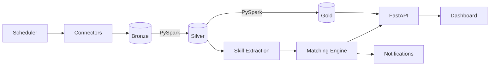

# Job Intelligence Platform

Piattaforma per raccogliere, normalizzare e analizzare offerte di lavoro
nei settori Bancario, Assicurativo e Pubblica Amministrazione — progetto
portfolio da Senior/Lead Data Engineer.

**Stato attuale: Fase 1 — Ingestion Layer** (Greenhouse + SmartRecruiters,
architettura estendibile a Workday/SuccessFactors/inPA).

## Architettura



## Struttura repository

```
src/ingestion/
    models.py          # schema Bronze (RawJobPosting)
    base.py             # contratto connector + retry/backoff + rate limiting
    config.py           # elenco dichiarativo delle fonti (TARGETS)
    runner.py           # orchestrazione parallela (ThreadPoolExecutor)
    connectors/
        greenhouse.py
        smartrecruiters.py
tests/
    test_connectors.py  # unit test con mock, nessuna chiamata di rete reale
```

## Setup locale

```bash
# 1. Clona ed entra nella cartella
cd job-intel-platform

# 2. Crea virtual environment
python -m venv .venv
source .venv/bin/activate      # su Windows: .venv\Scripts\activate

# 3. Installa le dipendenze (dev include pytest/ruff/mypy)
pip install -r requirements-dev.txt

# 4. Esegui i test
pytest tests/ -v

# 5. Lancia l'ingestion (chiamate reali alle API pubbliche)
python -m src.ingestion.runner
```

## Fonti supportate (Fase 1)

| Fonte | Tipo accesso | Risk tier | Note |
|---|---|---|---|
| Greenhouse | Job Board API pubblica | `none` | Nessuna auth richiesta |
| SmartRecruiters | Posting API pubblica | `none` | Nessuna auth richiesta |
| Workday | Endpoint JSON tenant (non documentato) | `medium` | Prossima ondata |
| SAP SuccessFactors | `sitemap.xml` pubblico | `low` | Prossima ondata |
| inPA (PA italiana) | Scraping rispettoso banca dati bandi | `low` | Prossima ondata |
| LinkedIn | — | `excluded` | ToS vieta scraping automatizzato |

Per aggiungere una nuova fonte: creare una classe in `connectors/` che
eredita `JobBoardConnector`, registrarla in `runner.py`, aggiungere le
righe target in `config.py`. Nessun'altra modifica richiesta.

## Prossimi step

- **Fase 2**: Bronze layer su Delta Lake (persistenza raw + metadata).
- **Fase 3**: Silver layer, schema unificato via PySpark.
- **Fase 4**: Gold layer, viste analitiche.
